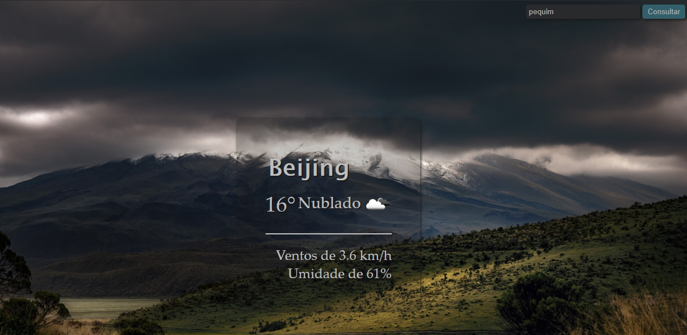

# MaisClima
Projeto com o objetivo de aprender a utilizar API em uma aplicação.

Neste caso utilizamos a API Current Weather Data da Open Weather que pode ser encontrada em https://openweathermap.org/api

Nosso site pode ser visto em: http://maisclima.atwebpages.com/index.html

# Ferramentas:
  - HTML, CSS  e JavaScript

# Novas Funcionalidades e Correções a serem implementadas
  - aumentar o número de imganes selecionando randomicamente dentro de um grupo de imagens daquele clima;
  - escolher entre imagens diurnas e norturnas conforme o horário da localidade pesquisada;
  - correção: mostrar o nome correto do fotógrafo da imagem selecionada;
  - correção: alterar posição da consulta inicial.
